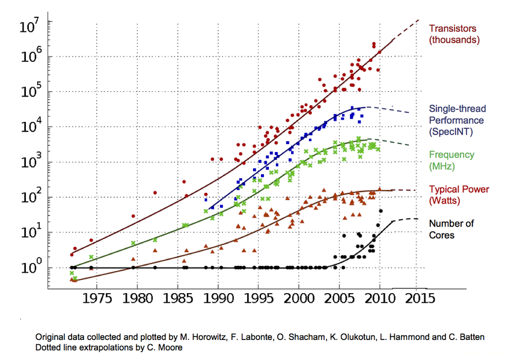

# Lezione 1

<style>
.row {
  display: flex;
}

.column {
  padding: 10px;
  flex: 50%;
}
</style>

## Le motivazioni dietro lo studio dei compilatori

Lista elementi di un compilatore che non conoscevo: 
- **start up code** $\longrightarrow$ primo codice eseguito 
- **linker script** $\longrightarrow$ posiziona i segmenti in sezioni specifiche della memoria
- **objcopy** $\longrightarrow$ da file eseguibile a file binario
- **objdump** $\longrightarrow$ riproduce codice assembly a partire dall'eseguibile (disassemblaggio)


Funzioni dei compilatori:
- Trasformare codice da un linguaggio di un certo livello ad uno più basso.
- Migliorare codice per **performance**, ridurre **overhead**, efficienza **energetica**.

<div class="row">
    <div class="column">La legge di Moore continua a valere negli anni, ovvero il numero di transistors raddoppia ogni anno, lo scaling di **Dennard** invece no, dopo il 2004 la frequenza tende a diminuire per lasciare spazio a più core. La performance dei programmi ha smesso di aumentare nonostante i processori multicore sono più potenti in quanto le suite per il benchmark sono scritte per girare su un singolo core. Qui viene mostrato il motivo dell'importanza dello scrivere codice parallelo che riesce a sfruttare più core.
    </div>
    <div class="column">
        
    </div>
</div>


I programming models sono estensioni del compilatore che aiutano a implementare la parallelizzazione per i programmatori, interfacciandoli con **runtime environments**, ovvero librerie che vengono linkate al programma, che contengono informazioni sullo stato.

Negli anni si passa dalla CPU multipurpose a una CPU generale a cui vengono affiancati degli acceleratori specifici per determinati tipi di calcolo, come le GPU (acceleratori per la grafica). Questo è un ottimo esempio di **eterogeneità** architetturale. Le GPU possono essere integrate direttamente sul chip della CPU o discrete (es: gtx 1060).


## Ottimizzazione

Metriche fondamentali:

- Performance = $\frac{1}{\mathit{Execution Time}}$

- Execution Time = $\frac{\mathit{Instruction Time}\cdot \mathit{CPI}}{\mathit{Frequency}}$


Per quanto riguarda la frequenza, questa si basa sull'hardware. Allo stesso modo il CPI, anche se si possono scegliere istruzioni che eseguono in meno cicli.

Esempi di ottimizzazione:

- **Algebraic Simplifications**: degli esempi potrebbero essere doppia negazione e espressioni logiche vengono semplificate

- **Constant Folding**: Valuta a compile time la valutazione di costanti. Ad esempio se si ha già tutto per eseguire un istruzione, la si esegue a compile time (es x = 100 + 3)

- **Strength Reduction**: sostituisce operazioni costose con altre più semplici, come $mul \longrightarrow add/shift$. Ad esempio $y = x*17 \longrightarrow y = (x<<4) + x$. Aiuta a ridurre CPI medio.

- **Dead Code Elimination**: Rimuove codice non necessario, come variabili assegnate, ma mai lette o codice irraggiungibile. Ad esempio ```if (100 < 0) { a = 5; }``` dove in realtà $100 \lt 0 $ è un Algebraic Simplification, quindi equivale a False.

- **Copy Propagation**: Per uno statement x=y sostituisce gli usi futuri di x con y. Spesso la Dead Code Elimination viene chiamata diverse volte.

- **Constant Propagation**: Vengono sostituiti gli usi futuri du una costante con il suo valore. Es: ```b = 3; c = 1 + b``` $\longrightarrow$ ```b = 3; c = 1 + 3```, da cui segue che si può applicare prima costant folding, poi constant propagation, nuovamente costant folding e infine dead code elimination.

- **Loop Invariant Code Motion**: sposta fuori dal loop le istruzioni non dipendenti da questo. 
    ```c
    for (int i = 0; i < 100; i++) {
        c = x/y + i
        print(c)
    }
    ```
    diventa 
    ```c
    t = x/y
    for (int i = 0; i < 100; i++) {
        c = t + i 
        print(c)
    }
    ```

La maggior parte delle ottimizzazioni vengono fatte sui loop in quanto secondo diversi profiling rappresentano la maggior parte del tempo di esecuzione di un programma. 
Degli esempi di ottimizzazioni sono:
- Register allocation (**spilling** dei registri)
- Instruction-level parallelism (varie istruzioni che possono eseguire allo stesso tempo. Un esempio è quello della pipeline con 5 istruzioni che eseguono contemporaneamente, senza data hazard. Ad ogni nop inserita viene ridotto il CPI medio)
- Data parallelism
