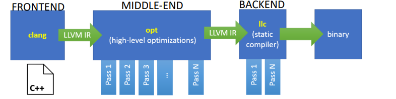
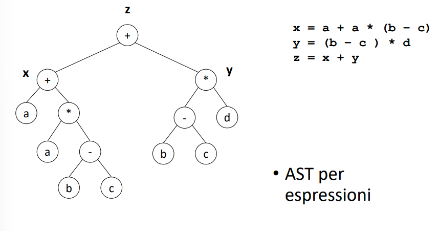
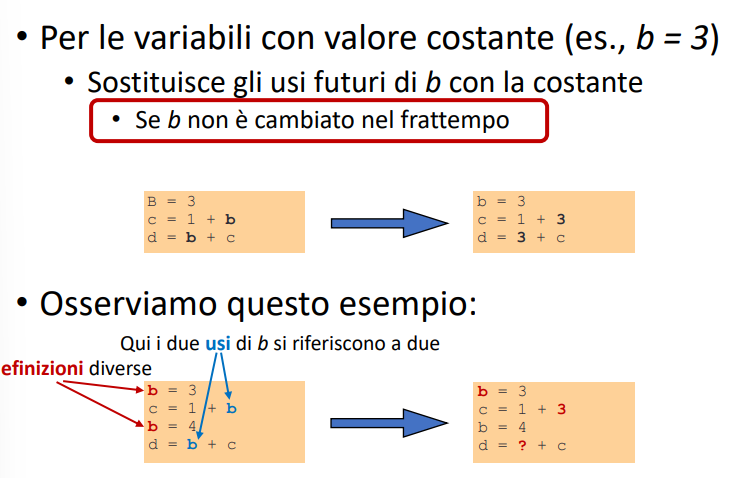
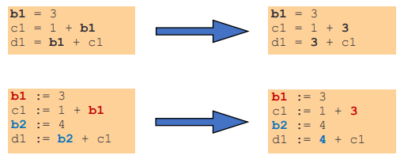
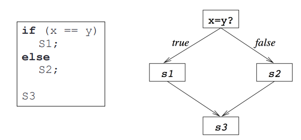
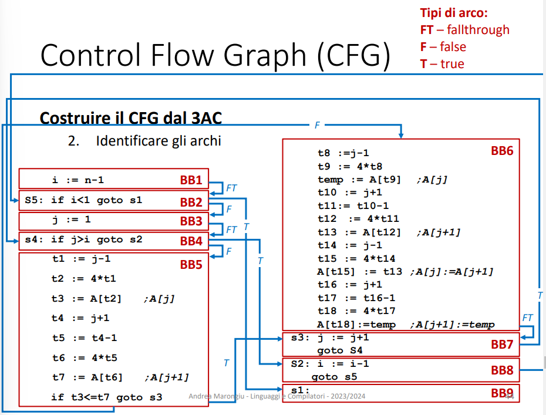
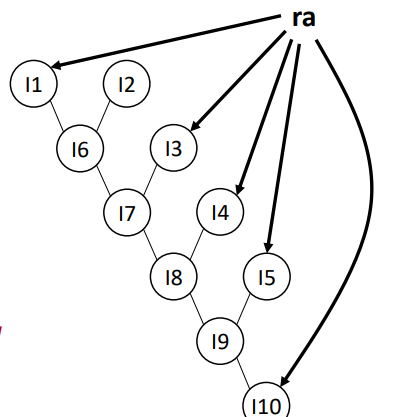
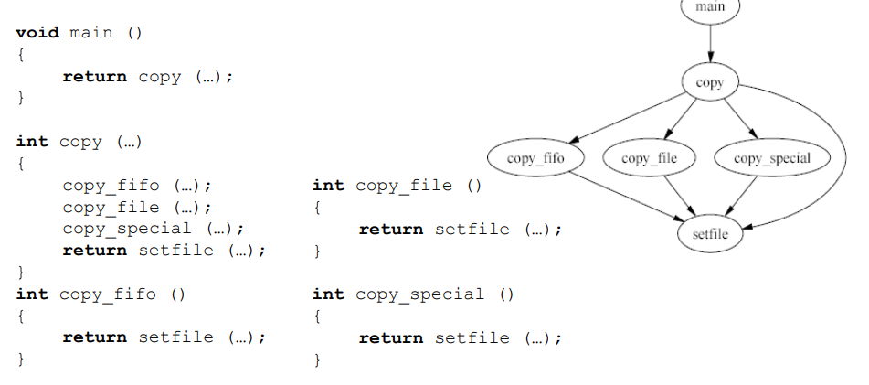

[comment]: <> (Argomenti: #anatomia di un compilatore, #flag ottimizzatore, #proprietà IR, #categorie IR, #3-address code)

# Lezione 2

## Anatomia di un compilatore

Un compilatore si divide in:

- **front-end** (_clang_) che prende in ingresso il codice in un linguaggio di alto livello e produce una rappresentazione intermedia che mantiene la stessa semantica, ma aiuta il compilatore ad ottimizzare il codice.
- **middle-end** (_opt_) che svolge una ottimizzazione **indipendente** dall'architettura del calcolatore attraverso vari **passi**. 
- **back-end** (_llc_) che, data l'analisi del sorgente, trasforma l'IR ottimizzato in codice macchina con ulteriori ottimizzazioni dipendenti dall'architettura. 




## Flags opt

Il middle-end di llvm si chiama opt e può essere invocato con diverse flag
- _-g_ $\longrightarrow$ debugging
- _-O0_ no ottimizzazioni
- _-O1_ ottimizzazioni veloci come CP, CF, CSE, DCE...
- _-O2_ ottimizzazioni lente e aggressive
- _-O3_ esegue i passi in un ordine che sfrutta compromessi tra velocità e spazio occupato 
- _-Os_ size del compilato, per hardware particolari che hanno limiti alla memoria.

E' importante avere il blocco di middle-end perchè fa da _divisore_ tra il front-end e il back-end (ricevendo l'IR in input dal primo e passandolo in output al secondo). In questo modo per supportare un nuovo linguaggio sarà necessario riscrivere solo la parte di front-end, mentre per supportare un nuovo target solo la parte di back-end. 

## Proprietà IR


Sono:
- Facilità di generazione
- Facilità di manipolazione (si aggiunge costo delle strutture dati utilizzate)
- Costo di manipolazione
- Livello di astrazione 
- Livello di dettaglio esposto

Esistono di conseguenza diversi tipi di IR, che potrebbero anche coesistere:
- Abstract Syntax Tree (**AST**)
- Directed acyclic graphs (**DAG**)
- 3-address code (**3AC**)
- Static single assignment (**SSA**)
- Control flow graphs (**CFG**)
- Call graph (**CG**)
- Program dependence graphs (**PDG**)

Si dividono in tre categorie:
- **Grafiche** o strutturali, comode per linguaggi di alto livello, espressive e voluminose. (DAG, AST)
- **Lineari**, pseudocodice meno vincolato dell'assembly, che non ha un numero di registri finito. (3-address code)
- **Ibride**, combinazioni di entrambe, come Control Flow Graph.

## Scelta IR

Occorre scegliere l'IR in base al compito, probabilmente **sceglierne una sola non è sufficiente**, in quanto nessuna delle IR riportate è sufficiente per ogni scopo.

## Abstract Syntax Tree

In questo tipo di IR abbiamo un albero i cui nodi rappresentano diverse parti del programma. La radice è il _programma_, che contiene un blocco di istruzioni, dal quale discendono tanti figli quante sono le istruzioni.



E' molto comodo per scrivere un interprete e si può processare l'albero con una funzione ricorsiva. Il problema è che quasi tutti i nodi dell'albero sono semanticamente diversi

## Directed Acyclic Graph 

Rispetto all'AST ha una rappresentazione più compatta ed è in grado di evitare la duplicazione di espressioni senza assegnamento (ovviamente il valore di un'espressione non dev'essere cambiato nel tempo per poterla riutilizzare). 


## 3-Address Code

In 3-addr code si trasformano tutte le istruzioni in corrispettive con un unico operatore e al **massimo 3 operandi**, come in assembly RISC-V. Ad esempio:
```
x - 2 * y
```
diventa
```
t1 = x - 2
t2 = t1 * y
```
dove i registri temporanei **non sono limitati**. Utilizza il concetto di goto per tutti i tipi di ciclo.
Esistono due rappresentazioni:
- record di quadruple, con indice op, operazione, registri
- record di triple, con indice, op e registri operandi

### Esempio Constant Propagation (CP)



La forma 3-addr code ci rende possibile se la definizione di b è cambiata nel frattempo? Non è possibile applicare le ottimizzazioni senza prima analizzare l'evoluzione temporale delle espressioni.

La soluzione è la forma SSA, descritta successivamente.

## Static Single Assignment

Ogni variabile è definita solo una volta e definizioni multiple diventano multiple versioni della variabile.
Ogni definizione ha una lista di tutti i suoi usi (esempio: una variabile operando di un'istruzione è un uso di una qualche definizione). Permette di semplificare di molto l'analisi.




## Control Flow Graph

Ricordare che il _program counter_ della CPU ha due multiplexer, uno somma PC+4, mentre l'altro somma PC+imm<<1 (proveniente dall'istruzione di controllo di flusso, ```beq s1, s2, 0ximm```).




**Basic Block** contengono una sequenza lineare di istruzione ed è terminato da un'istruzione di **trasferimento del controllo**, è l'unità base del grafo del CFG. Gli archi in questo grafo rappresentano il flusso di controllo (es: _loop_, _if/else_, _goto_).

I componenti del CFG sono quindi:
- Basic Block $B_i$ è una sequenza di istruzioni in forma 3AC. 
    - Solo la prima istruzione di un BB può essere raggiunta dall'esterno, ha un **unico entry point**.
    - Tutte le istruzioni del blocco sono eseguite se viene eseguita la prima, ha un **singolo exit point**.
- Un arco connette $B_i \longrightarrow B_j$ se e solo se $B_j$ può eseguire dopo $B_i$ in qualche percorso del flusso del programma.

Capiamo quindi che ha la proprietà SESE (single entry, single exit). Esistono regioni del programma che raggruppano più basic block che hanno la stessa proprietà.
Se un blocco non ha istruzione di salto, si ha **fallthrough**, da cui abbiamo che si possono creare dei basic blocks **massimali** Occorre rispettare la proprietà SESE:
```
BB1:
    In1
    In2
    beq s1, s2, BB3
BB2:
    In1
    #non abbiamo un'istruzione di CF
BB3:
    In1
    In2
```
In questo esempio abbiamo che BB3 è accessibile da BB1, quindi non si può creare un blocco massimale (BB2, BB3), nonostante non ci sia un'istruzione di CF in BB2.  

### Costruzione CFG

- Identificare il **Leader** di ogni BB, che solitamente è la prima istruzione, il target di un salto o ogni istruzione che viene dopo un salto.
- Il BB comincia con il Leader e termina con l'istruzione precedente a un nuovo Leader
- Connettere i BB tramite archi di 3 tipi:
    - _fallthrough_ $\longrightarrow$ esiste solo un percorso tra due BB
    - _true_ $\longrightarrow$ il secondo blocco è raggiungibile solo se viene rispettata condizione True
    - _false_ $\longrightarrow$ il secondo blocco è raggiungibile solo se viene rispettata condizione False

Nell'immagine seguente possiamo osservare un programma diviso completamente in BB collegati da archi denotati dal tipo (FT, T, F):    




## Dependency Graph

Sono dei grafi che servono ad analizzare le dipendenze tra gli operandi delle varie istruzioni.



Sono indispensabili per l'**instruction scheduling** (ricordare _data hazard_).
Nei **Data Dependency Graph**, la dipendenza non è più nelle istruzioni, ma sul dato.

$\diamond$ Da completare


## Call Graph

Mostra l'insieme delle _potenziali_ chiamate tra le funzioni in modo gerarchico.


