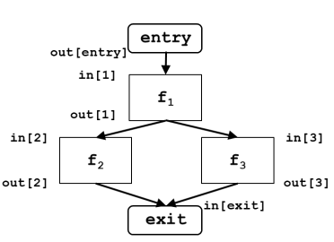

# Data Flow Analysis

Si contrappone alla scorsa lezione perchè è un'analisi globale, dove si controlla ogni basic block.
Ci permette di derivare da ogni variabile _x_ informazioni come:
- Valore di _x_
- Istruzione che definisce _x_
- Se la definizione è **live**

## Effetti BB

Un'istruzione può avere diversi effetti, tra cui, considerando ad esempio ```a = b  +  c```:
- **Use** $\longrightarrow$ delle variabili (b, c)
- **Kill** $\longrightarrow$ una precedente definizione (a)
- **Define** $\longrightarrow$ una variabile (a)

Componendo gli effetti delle singole istruzioni arriviamo agli effetti di un basic block:
<div id="definizionieffetti"></div>
- Un **uso localmente esposto** in un BB è un uso di una variabile che non è preceduto nel BB da una definizione della stessa variabile
- Ogni definizione di una var nel BB uccide tutte le definizioni della stessa variabile che sono in grado di arrivare a quel BB
- Una **definizione localmente disponibile** è l'ultima definizione di una variabile nel BB


Ad esempio: 
```c
t1 = r1 + r2 // Usi localmente esposti: r1, r2
r2 = t1 // Definizioni uccise: r2
t2 = r2 + r1 
r1 = t2
t3 = r1 * r1
r2 = t3
if r2 > 100 goto L1
```

## Reaching Definitions

Si può considerare ogni **istruzione di assegnamento** come una **definizione**. Una definizione _d_ raggiunge (**reaches**) un punto _p_ se **esiste** un percorso da _d_ a _p_ per cui _d_ **non è uccisa** lungo quel percorso.

Si creano quindi tanti **bit vector** quanti sono i punti del programma, ovvero le sue istruzioni e la lunghezza di questi vettori è pari al numero di definizioni.

Anche se ci sono branch in cui una definizione viene "killata", se esiste almeno un branch che la collega al punto, allora c'è reach.

## Schema DF analysis

Consideriamo un flow graph e aggiungiamo due BB, uno di entry e uno di exit, in modo da avere una singola entrata/uscita.



Definiamo un insieme di equazioni $in[b]$ e $out[b]$ per ogni basic block _b_. Abbiamo delle **funzioni di trasferimento** $f_b$ che correlano $in[b]$ e out[b] per un dato _b_. 

Abbiamo che per un generico statement _s_, come una definizione $d: x = y + z$:
$
    out[s] = f_s(in[s]) = Gen[s] \cup (in[s]-Kill[s])
$
dove:
- $Gen[s]$ è l'insieme delle definizioni **generate** 
- $Kill[s]$ sono le altre definizioni di _x_ nel programma
- $in[s] - Kill[s]$ sono le definizioni **propagate**

La funzione di trasferimento di un **basic block B** è la composizione delle funzioni di trasferimento degli statement in B.
$
    out[B] = f_b(in[B]) = f_2f_1f_0(in[B])
$

di conseguenza, abbiamo che:
- $Gen[B]$ è l'insieme delle <a href="#definizionieffetti">definzioni localmente disponibili</a>  
- $Kill[B]$ è l'insieme delle definizioni uccise da B

I nodi di **join** sono nodi con multipli predecessori e si può usare l'operatore di **meet** (unione) per rappresentare:
$
    in[b] = out[p_1] \cup out[p_2] \cup ... \cup out[p_n]
$

## Live Variable Analysis

Una variabile *v* è viva (**live**) in un punto _p_ del programma se il suo valore è usato lungo qualche percorso del flow graph a partire da _p_. La motivazione che ci porta a questo tipo di analisi è l'allocazione dei registri, in modo che possano essere riutilizzati se una variabile non è più live (**dead**).

Un modo di risolvere il problema è il tracciare gli usi all'indietro fino alle definizioni.
Abbiamo in un Basic Block _b_:
- $Use[b]$ è l'insieme degli <a href="#definizionieffetti">usi localmente esposti</a> in b
- $Def[b]$ è l'insieme delle variabili definite in b
- $out[b] - Def[b]$ è la propagazione delle variabili vive in ingresso
- $in[b] = Use[b] \cup (out[b] - def[b])$ è la funzione di trasferimento per il blocco b

## Available Expression

E' utile in ottimizzazioni come **Global common Subexpression Elimination**, ad esempio se abbiamo:
```
if (cond) {
    x = m + n;
} else {
    y = m + n;
}
z = m + n;
```

in cui ```m + n``` è già stato calcolato e ricalcolarlo risulta **ridondante**.

Abbiamo un problema se ```m + n``` non viene calcolato ad esempio in uno dei due rami dell'_if_. Occorre quindi un modo di comprendere meglio la ridondanza. Ci interessano solo le espressioni **binarie** nella forma $x \oplus y$.

### Terminologia

- Una espressione $x \oplus y$ è **available** in un punto _p_ del programma se ogni percorso che parte dal blocco **ENTRY** e arriva a _p_ valuta l'espressione $x \oplus y$.
- Un blocco **genera** l'espressione $x \oplus y$ se la valuta ma non ridefinisce ne x o y in seguito.
- Un blocco **uccide** l'espressione $x \oplus y$ se assegna un valore a x o y e non ricalcola successivamente $x \oplus y$

Ad esempio:
```c
x = y + 1; // genera y+1 
y = m + n; // genera m+n uccide y+1
```

La funzione di transfer si può definire così:
$
f_b = gen_b \cup (x - kill_b)
$


Per riassumere: 
- Nell’analisi delle available expressions eliminiamo
un’espressione perché è stata calcolata in passato
- Nell’analisi delle live variables eliminiamo una
variabile perché non verrà usata in futuro


nell'immagine precedente abbiamo come meet operator $\cap$ perchè ci interessa che tutti i percorsi mantengano le condizioni, e non almeno uno. Mentre le 