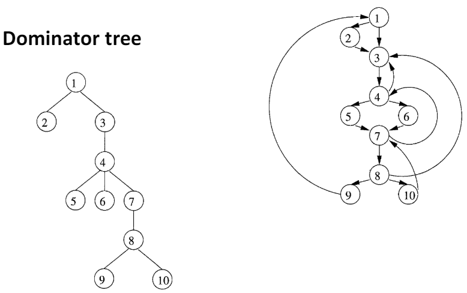
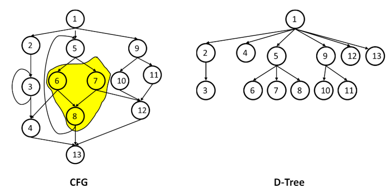

## Loop

I programmi spendono la maggior parte del tempo di esecuzione all'interno di loop, quindi conviene saperli rappresentare correttamente in IR.

L'obiettivo è di definire in termini di teoria dei grafi un loop, in modo indipendente dalla sintassi: unica sia per for, che per while o goto.

Intuitivamente si può subito dire che un loop, per essere tale:
- deve avere un **unico entry point**
- gli archi devono formare un ciclo

## Dominator

Un concetto molto utile che ci porterà alla definizione di loop è quello dei **dominator**. Un nodo _d_ domina un nodo _n_ in un grafo (_d_ **dom** _n_) se ogni percorso dall'entry a n passa necessariamente per _d_. Una definizione più stretta è quella di **immediate dominator** ed è l'ultimo **dominator** di _n_ su un qualsiasi percorso da _entry_ a _n_.

## Loop naturali

Dal punto di vista dell'analisi, non ci importa lo specifico modo in cui è implementato un loop, ma solo che la rappresentazione abbia le proprietà che sono state accennate prima:
- Singolo entry point, con **header** del loop che domina tutti i suoi nodi
- Ha almeno un **backedge**, ovvero un arco la cui testa domina la propria coda

Per identificare un loop naturale ci sono tre step principali:
1. Trovare le relazioni di dominanza nel flow graph
2. Identificare i backedges
3. Trovare il loop naturale associato al backedge

### Primo punto

Lo si può formulare come un problema DFA:

|                               | Dominator analysis                                               |
|-------------------------------|------------------------------------------------------------------------------|
| **Dominio**                   | nodi --> basic blocks                       |
| **Direction**                 | Forward: $out[b] = f_b(in[b]), in[b] = (\wedge out[pred(b)])$                |
| **Transfer Function**         | $f_b(x)=gen_b(\cup(x))$                                           |
| **Meet Operation**            | $(\cap)$                                                                   |
| **Boundary Condition**        | $out[entry]=(\{\})$                                                         |
| **Initial Interior Points**   | $out[b]=U$                                                                |

### Trovare i Back Edges

Si effettua una traversata **depth-first**, che inizia dalla radice e ricorsivamente visita i figli di ogni nodo in ordine qualsiasi, non necessariamente da sx a dx. 

Gli archi nel grafo possono rientrare in una delle tre seguenti categorie:
- **Advancing**: da antenato a discendente
- **Retreating**: dal discendente all'antenato (anche da un nodo a se stesso)
- **Cross**: da nodo _m_ a _n_, dove non sono nè antenati, nè discendenti

Un arco backedge è un arco che va da _t_ a _h_ con _h_ che domina _t_.  Per ogni retreating edge segnata dalla DFS, si controlla se h è nella lista dei dominatori di t, in modo che non si possa arrivare a t da strade alternative, il che significherebbe avere del codice che punta all'interno del corpo del loop.

### Trovare il loop naturale

Il loop naturale corrispondente a un backedge è il più piccolo insieme di nodi che include head e tail del back edge e non ha predecessori fuori da questo insieme, a parte il **pre-header**.

L'algoritmo per individuare il loop è di rimuovere _h_. Tutti i nodi che raggiungono _t_ sono il corpo del ciclo.